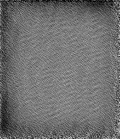

# energy-based-representation-learning
Unsupervised learning of energy representations using MRIs.

## Setup

```bash
pip install -r requirements-comet.txt
pre-commit install
```

## Reproduce our results


<p align="center">
  
</p>

If you wish to train a new model, you can connect to the HPC (if you have access) and run the following command:

```bash
bsub < path/to/bsubs/scrupts
```

If not, you can simply run the train.py script and modify the config file you want to use. We have used 2DMRI_config.yml as the main config file for our runs. Hence in your terminal run:

```bash
python src/train.py
```

To choose an alternative configuration file than the default 2DMRI, you have to alter it in the command line. If you run into memory issues, you can lower the batch size, number of steps and components significantly.
```bash
python src/train.py --config='src/config/my_config.yml'
```


For running the code on the CLEVR dataset, you can use the following command:

```bash
python src/train.py --config='src/config/clevr_config.yml'
```


## Reproducing COMET results

<p align="center">
  
</p>

If you want to run the comet code, go to the comet dir ''cd comet'' and run the following command:

Their clevr dataset:
```bash
python train.py --exp=clevr --batch_size=12 --gpus=0 --cuda --train --dataset=clevr --step_lr=500.0
```

2DMRI Data: 
```bash
python train.py --exp=MRI2D --batch_size=12 --gpus=0 --cuda --train --dataset=MRI --step_lr=500.0
```


# Evaluate our trained models:

To evaluate a model trained on our code, you can run the following command:

```bash
python src/test_final.py --config='src/config/2DMRI_config.yml' --checkpoint='path/to/your/model_checkpoint.pth'
```
The script is designed to test a trained model on a dataset, reconstruct images, and visualize the results (including saving a GIF and a PNG of reconstructions).
- --config: Path to the YAML configuration file (default: 2DMRI_config.yml)
- --checkpoint: Path to the trained model checkpoint (default: models_UN652_10100.pth)

**Outputs:**
- A GIF showing the image generation process is saved in videos.
- A PNG image of reconstructions by latent components is also saved in videos.


# Evalute the COMET models:

To evaluate a model trained on COMET, you can run the following command:

```bash
python src/test_comet_model.py --checkpoint='path/to/your/model_checkpoint.pth' --index=0
```
- --checkpoint: Path to the trained model checkpoint (default: clevr_comet_99900.pth.pth)
- --index: Index of the image in the dataset to reconstruct (default: 0)

This script tests a trained LatentEBM model on the CLEVR dataset, reconstructs images, and visualizes the results. It saves a GIF of the image generation process and a PNG of reconstructions by latent components.

**Outputs:**
- A GIF of the image generation process is saved to src/videos/clevr_<checkpoint_name>.gif
- A PNG of reconstructions by latent components is saved to src/videos/clevr_reconstructed_<checkpoint_name>.png


# Good to know

To avoid module not found error, run the following command:
```bash
export PYTHONPATH="."
```

This will ensure that Python can find the modules in the current directory.

When you have queued a job to the HPC, there a few good-to-know commands:

```bash
bjobs 
bkill job_id
bqueues
```

First one is to see the status of your queued jobs, second is to kill a specific job, last is to see the general queue on the HPC. 